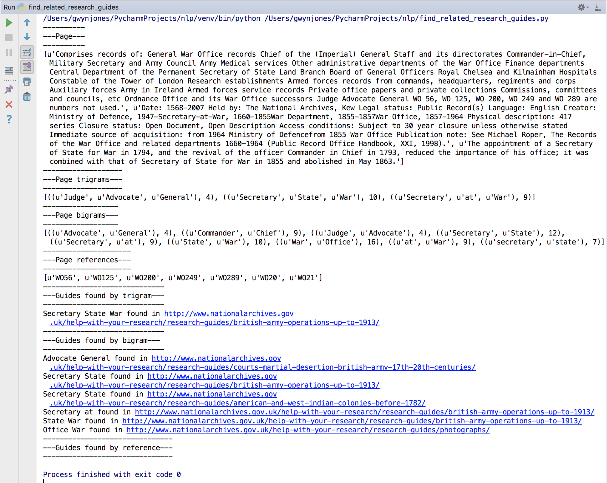

# NLP

## Finding research guides that seem related to a specific details page

Running the `find_related_research_guides.py` module will identify what it thinks might be the guides related to the Discovery details page(s) listed in the script. To do this it:

* creates a 'details page' object which contains:
    1. an NLP generated summary of the details page (See `get_summary()`)
    2. lists of the top bigrams and trigrams (See `get_trigrams()` and `get_bigrams()`)
    3. a list of document references (See `extract_references()`)
* Looks for the top bigrams and trigrams the in the details page to the those found in all research guides (those in the research guides have been pre-compiled by `generate_decorated_research_guides.py` to `/generated/decorated_guides.json`)

For example, for http://discovery.nationalarchives.gov.uk/details/r/C259 it suggests

